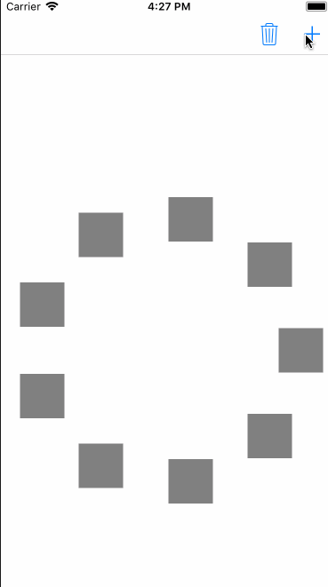

<h1 align="center">圆形的collectionViewCell布局</h1>

<center></center>

上图的翻转动画, 添加cell动画, 删除cell动画在另一篇文章中, 这里只记录如何实现圆形的cell布局

##1. 首先我们要实现一个普通的CollectionView
<center></center>
##2. 自定义一个继承自`UICollectionViewFlowLayout`的`AnimatorFlowLayout`, 并在`AnimatorFlowLayout中实现下面两个方法`


```
//为每一个cell设置布局属性
- (UICollectionViewLayoutAttributes *)layoutAttributesForItemAtIndexPath:(NSIndexPath *)indexPath {
    UICollectionViewLayoutAttributes *attributes = [UICollectionViewLayoutAttributes layoutAttributesForCellWithIndexPath:indexPath];
    attributes.size = CGSizeMake(50, 50);
    float radius = 150;
    CGPoint center = CGPointMake(SWidth / 2.0, SHeight / 2.0);
    float x = center.x + radius * cosf(2 * M_PI / self.cellCount * indexPath.item);
    float y = center.y - radius * sinf(2 * M_PI / self.cellCount * indexPath.item);
    attributes.center = CGPointMake(x, y);
    
    return attributes;
}

//返回某个rect中的所有的layoutAttributes
-(NSArray*)layoutAttributesForElementsInRect:(CGRect)rect{

    NSMutableArray* attributes = [NSMutableArray array];
    for (NSInteger i=0 ; i < self.cellCount; i++) {
        //这里利用了-layoutAttributesForItemAtIndexPath:来获取attributes
        NSIndexPath* indexPath = [NSIndexPath indexPathForItem:i inSection:0];
        //调用第一个方法
        [attributes addObject:[self layoutAttributesForItemAtIndexPath:indexPath]];
    }
    return attributes;
}
```
